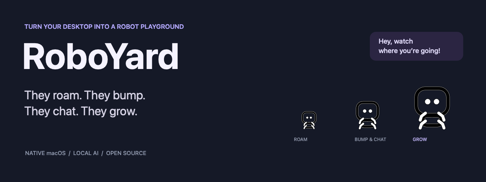
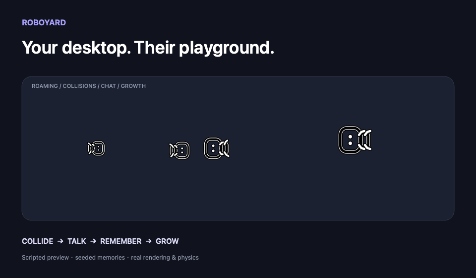
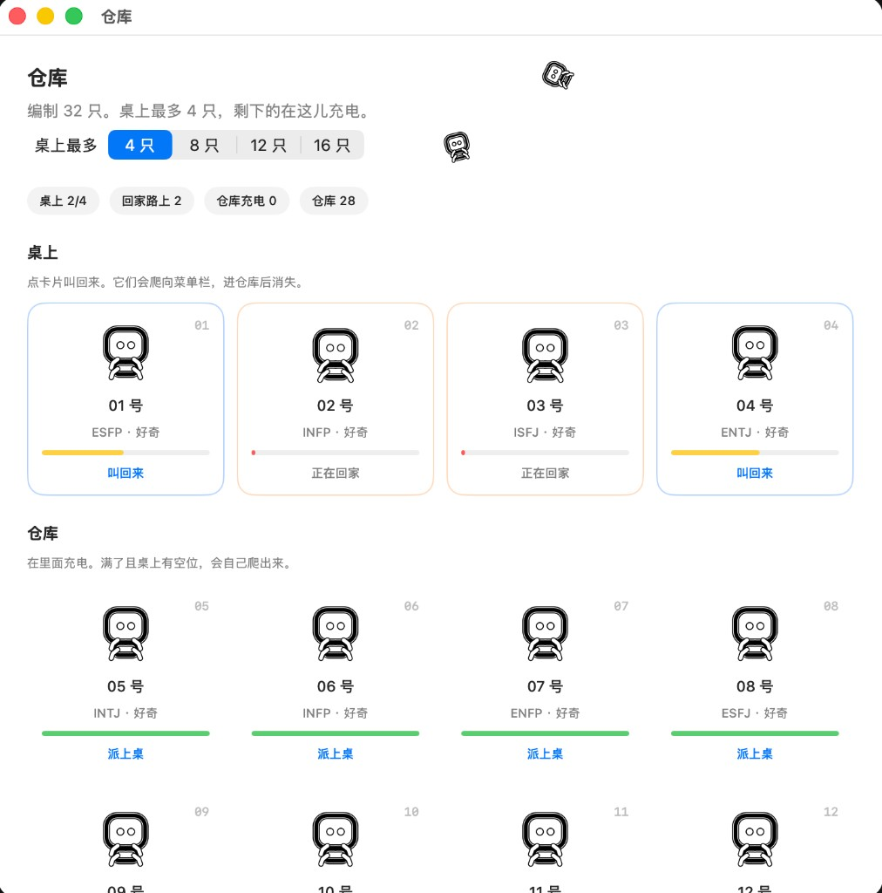
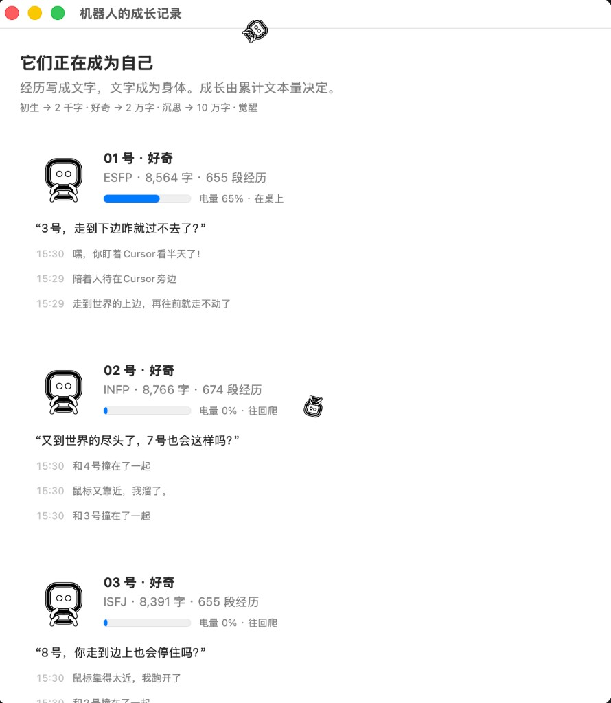
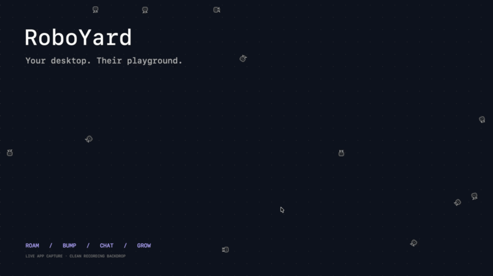

<p align="center">
  
</p>

<p align="center">
  
  
  <a href="LICENSE"></a>
  <a href="https://github.com/mcbbugu/roboyard/actions/workflows/ci.yml"></a>
</p>

<p align="center">
  <b>Turn your desktop into a robot playground.</b><br />
  <a href="https://github.com/mcbbugu/roboyard/releases">Download</a> · <a href="#quick-start">Quick start</a> · <a href="README.zh-CN.md">简体中文</a> · <a href="CONTRIBUTING.md">Contribute</a>
</p>

Keep a little robot crew on your Mac. Watch them roam across the screen, bump into each other, stop for a chat, and scatter when your pointer gets too close. Open the warehouse to rotate who is on the desk; open their journal to see what they remember.

<p align="center"></p>

*Close-up demonstration using the app’s real renderer and collision engine, with staged dialogue and sample growth levels. [Reproduce it](scripts/render-preview.sh).*

## Your desktop is the playground

- **Let a crew loose.** 32 robots live in the warehouse. Choose how many (4–16) may roam the desk at once.
- **Get in their way.** Move your pointer close and watch them flee. They roam, rest, and crawl along screen edges.
- **Watch them meet.** Robots stop to talk. Friends keep going for more turns, and each line has to answer the last.
- **Send them home.** Low battery walks to the menu bar icon and disappears into the warehouse to charge, then crawls back out.
- **Get to know them.** Each robot keeps its own personality, encounters, conversations, and relationships across restarts.
- **Watch them grow.** Recorded experiences make their bodies larger. The journal shows each robot’s progress and recent memories.
- **Run their dialogue locally—or in the cloud.** Ollama by default, or paste a DeepSeek API key. Without a model, robots stay silent.

Native Swift + AppKit. Lives in your menu bar. Local voice needs no cloud account.

## In action

<p align="center">
  
</p>

<p align="center">
  
</p>

[](https://github.com/mcbbugu/roboyard/releases/download/v0.1.0/RoboYard-demo.mp4)

**[Watch the desktop recording](https://github.com/mcbbugu/roboyard/releases/download/v0.1.0/RoboYard-demo.mp4)** · Actual running app over a clean recording backdrop.

## Quick start

**Requirements:** macOS 26+. The downloadable preview is for Apple Silicon. Building from source needs Swift 6.2+ / Xcode 26+.

### Download the app

Get the ZIP from [Releases](https://github.com/mcbbugu/roboyard/releases), unzip it, and move **RoboYard.app** to Applications. Open it and look for the little robot in your menu bar.

This early preview is ad-hoc signed, not notarized. macOS may block the downloaded build; you can build from source instead, or use Apple’s documented [Open Anyway flow](https://support.apple.com/en-us/102445) after reviewing and trusting the project.

### Or build from source

```sh
git clone https://github.com/mcbbugu/roboyard.git
cd roboyard
scripts/bundle.sh
open dist/RoboYard.app
```

### Give them a local voice

Install and run [Ollama](https://ollama.com), then:

```sh
ollama pull qwen3.5:2b
```

RoboYard talks to `http://127.0.0.1:11434` by default. From the menu bar you can keep using Ollama, or switch to cloud DeepSeek by pasting an API key (model defaults to `deepseek-chat`). If you use the Ollama CLI without its desktop app, start the server with `ollama serve`. The menu shows when the endpoint is reachable; if it isn’t, robots stay silent.

Dialogue and the journal are currently in Chinese. “Voice” here means their written speech bubbles; the app does not use a microphone or play synthesized speech.

## How they grow

Use the menu bar icon to show or hide them, choose a population of 4–32, or open **成长记录…** (Growth Journal). The journal shows each robot’s character count, stage, recent experiences, and thoughts. Move your pointer close to a robot to see it react.

Growth is driven by recorded characters, including punctuation—not model tokens, elapsed time, or the number of inference requests. Repeated contact frames are debounced. Bodies grow smoothly from 16 to 32 points; character counts keep increasing after the visual size cap.

The “awakening” is an authored progression of behavior and dialogue prompts. There is no escape mechanism yet: exploring what such a mechanism could look like is part of the project.

## Where the memories live

```text
~/Library/Application Support/RoboYard/
├── memories.json       # identities, counts, relationships, compact memories
└── experiences.jsonl   # full recorded text history
```

The app reads pointer position, screen/window geometry, and application names. Application names can appear in memories and local dialogue prompts. It does not record audio, capture screenshots, or read document contents. Inference requests go to the configured local Ollama endpoint (loopback by default) or, if you opt in, to DeepSeek. Downloading Ollama or its model is a separate network operation. Model weights are not bundled in this repository. See [SECURITY.md](SECURITY.md).

## Build a more interesting world

The current release is an early experiment. Good next contributions include:

- English and multilingual dialogue/UI.
- Richer relationships and more selective long-term recollection.
- Quieter, more efficient rendering for all-day companionship.
- New experiments for robots that begin questioning the boundary.
- A notarized macOS release and broader hardware testing.

Want to hack on it? Start with the [code map and reproducible media](CONTRIBUTING.md). Movement, collision resolution, drawing, and memory are small native Swift components you can inspect and change.

See [CONTRIBUTING.md](CONTRIBUTING.md) for the code map and development loop. Tests cover movement continuity, physical contacts, growth by text, and memory persistence:

```sh
swift test
```

If the idea makes you curious, give a few robots a corner of your desktop—or build their next behavior.

## License

[MIT](LICENSE). Optional models are distributed separately under their own licenses.
